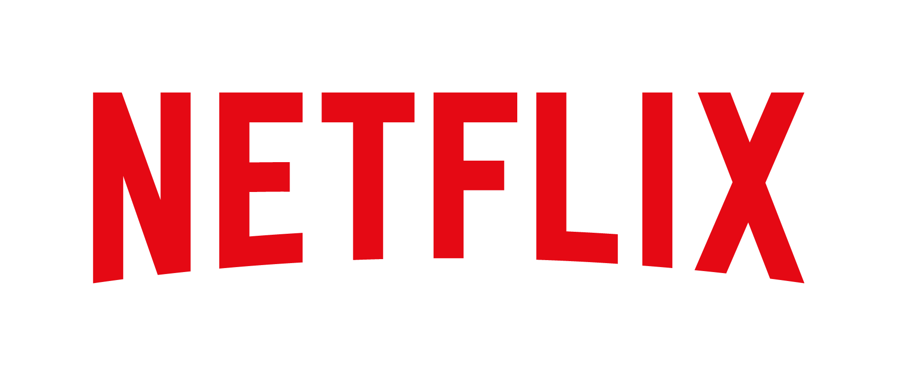
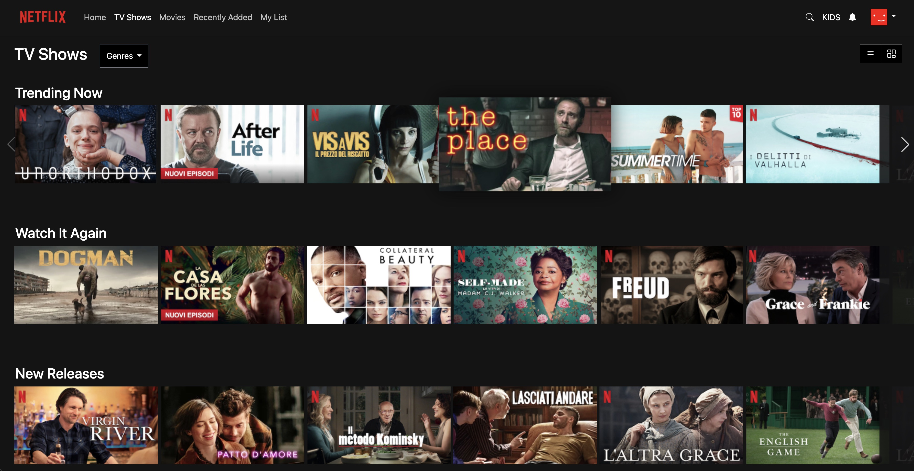

# Netflix TV Shows Clone

<p align="center">
  <a href="https://github.com/<your-username>/<your-repo-name>">
    
  </a>
</p>

<p align="center">
  A replica of the <strong>TV Shows</strong> page of Netflix, built with HTML, CSS, Bootstrap 5 and Swiper.js.<br/>
  Focus on layout, responsiveness and user experience with interactive carousels.<br/>
  <strong>This project was created as the final exam project for Module M3 of the Epicode course.</strong>
</p>

<p align="center">
  <a href="https://github.com/EmanWeBdV/EPICODE_M3-W4D4">
    
  </a>
  <a href="https://github.com/EmanWeBdV/EPICODE_M3-W4D4/issues">
    
  </a>
  <a href="#">
    
  </a>
</p>

<p align="center">
  <a href="#-preview">Preview</a>
  ·
  <a href="#-demo">Demo</a>
  ·
  <a href="https://github.com/EmanWeBdV/EPICODE_M3-W4D4/issues">Segnala un bug</a>
  ·
  <a href="https://github.com/EmanWeBdV/EPICODE_M3-W4D4/issues">Richiedi una feature</a>
</p>

---

## ✨ Preview

<p align="center">
  
</p>

---

## 🔗 Demo

- **Live demo:** https://EmanWeBdV.github.io/EPICODE_M3-W4D4/

---

## 🧭 Table of Contents

- [Preview](#-preview)
- [Demo](#-demo)
- [Features](#-features)
- [Tech Stack](#-tech-stack)
- [Project Structure](#-project-structure)
- [Installation](#-installation)
- [Usage](#-usage)
- [Swiper Configuration](#-swiper-configuration)
- [Responsiveness](#-responsiveness)
- [Roadmap](#-roadmap)
- [Contributing](#-contributing)
- [Author](#-author)
- [License](#-license)
- [Disclaimer](#-disclaimer)

---

## 🚀 Features

- **Netflix-like Navbar**
  - Netflix logo
  - Menu items: _Home, TV Shows, Movies, Recently Added, My List_
  - Right-side icons: search, “KIDS” label, notifications bell
  - Profile avatar with dropdown and multiple profiles

- **Page Header / Controls**
  - Main title: **TV Shows**
  - _Genres_ dropdown with categories (Action, Drama, Romantic, Horror, Thriller)
  - _List Mode_ and _Column Mode_ buttons (UI only, no data logic yet)

- **Content Carousels (Swiper.js)**
  - Sections:
    - _Trending Now_
    - _Watch It Again_
    - _New Releases_
  - Horizontal slider with:
    - Previous / next navigation arrows
    - Netflix-like effect with the next card partially visible (`slidesPerView: 6.2`)
  - Hover effect on cards:
    - `transform: scale(1.2)`
    - box-shadow to highlight the active card

- **Responsive Layout**
  - Based on **Bootstrap 5** grid system
  - Custom media queries for mobile / tablet / desktop

- **Footer**
  - Social icons (Font Awesome)
  - Links organised in multiple columns
  - “Service Code” button
  - Netflix-style copyright line

- **Educational Context**
  - Built as the **final exam project for Module M3 (Front-End)** of the **Epicode** course.

---

## 🧱 Tech Stack

<p align="left">
  
  
  
  
  
  
</p>

---

## 📂 Project Structure

```bash
.
├── index.html
├── .gitignore
├── assets
│   ├── css
│   │   └── styles.css          
│   ├── js
│   │   └── personalScript.js   
│   └── imgs
│       ├── Netflix_Logo_RGB.png
│       ├── Netflix_Symbol_RGB.png
│       ├── Netflix-profile-pic.jpg
│       ├── Netflix-profile-pic2.jpg
│       ├── Netflix-profile-pic3.jpg
│       └── movies/
│           ├── 1.png
│           ├── 2.png
│           ├── ...
│           └── 18.png
└── README.md
